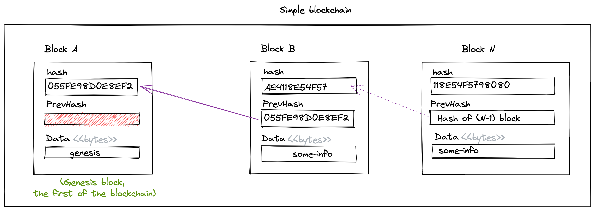
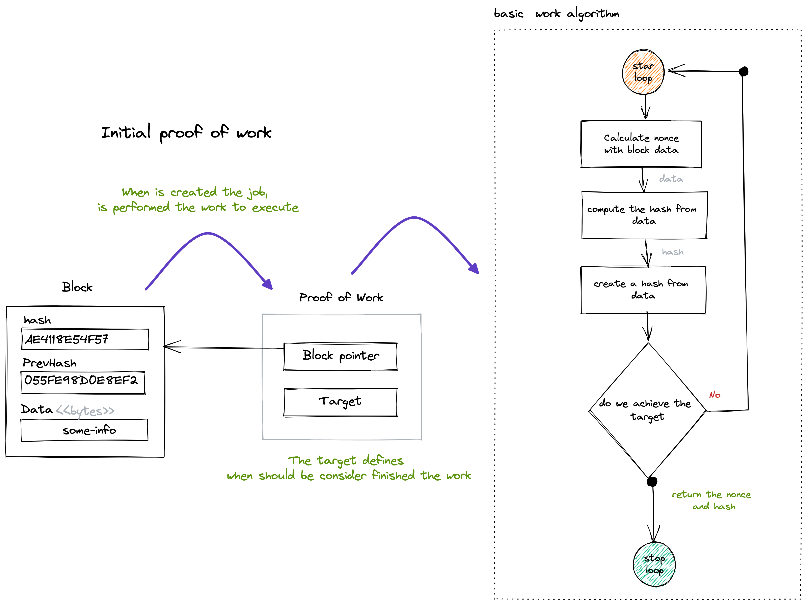

# Block

This is a small Block chain on Golang used to learn about the basic concepts of blockchain.

## Simple blochchain

The initial concept of blochchain could be asociated to a ledger book, in which you will add  a new transaction as is required.
In this case you will see a block after block storing the transaction information.

## Proof of work

The secure dimension of a blockchain is to guarantee data is legit added. To achieve it, the nodes in the blockchain network have to perform work, 
that implies high computational power. 

The following is an overview of how is implemented in this example

